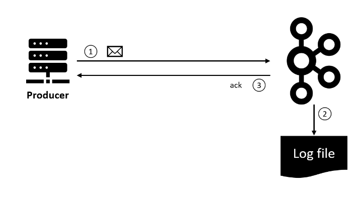
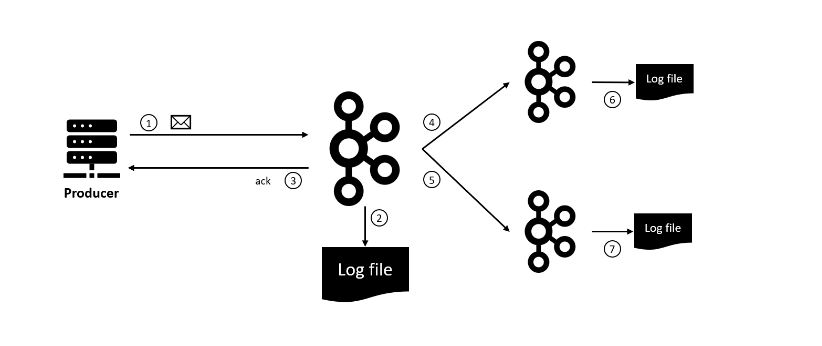
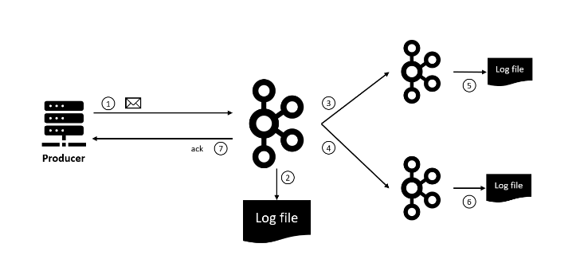
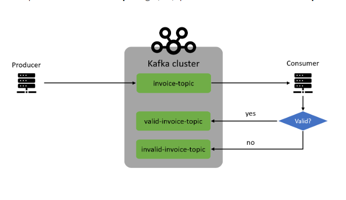
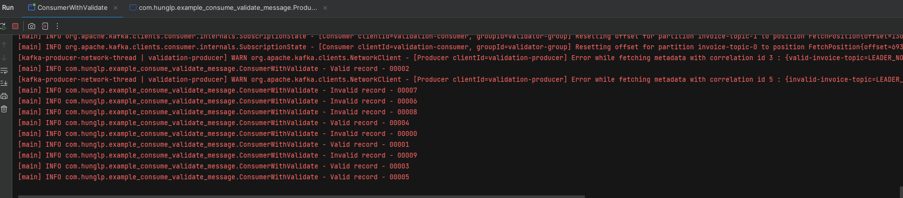

# KAFKA BASIC PRODUCE - CONSUME MESSAGE


## Phần 1. Produce SingleThread
### 1. Tạo topic:
- Tạo topic demo_java với partition = 3, replica-factor = 1 
```bash
kafka-topics.sh --bootstrap-server localhost:9092 --topic demo_java --create --partitions 3 --replication-factor 1
```

### 2. Tạo consumer:
```bash
`kafka-console-consumer.sh --bootstrap-server localhost:9092 --topic demo_java`
```
### 3. Run file Producer.java  =>  consume được message:
```bash
hunglp@HungLP:~$ kafka-console-consumer.sh --bootstrap-server localhost:9092 --topic demo_java

hello world
```

### Console log ở Consumer.java khi thực hiện produce message khác nhau ở file Producer.java

```bash
[main] INFO com.hunglp.Consumer - Key: null, Value: hello world
[main] INFO com.hunglp.Consumer - Partition: 2, Offset:0
[main] INFO com.hunglp.Consumer - Key: null, Value: tim em bao la
[main] INFO com.hunglp.Consumer - Partition: 2, Offset:1
[main] INFO com.hunglp.Consumer - Key: null, Value: Mac Ke doi cho nguoi ta
[main] INFO com.hunglp.Consumer - Partition: 2, Offset:2
```

## Phần 2: Các loại ack

### 1. Đặt vấn đề:


-  Trường hợp Replication Leader hoạt động tốt:
  + Sau khi nhận message từ producer, Kafka append vào partition log để đảm bảo ko bị mất message
  +  Mặc định, producer chờ ack từ kafka để biết chắc chắn message đã được append ở Replication Leader hay chưa
  + Nếu chưa được append ở replication Leader, thì sẽ thực hiển retry cho đến khi thành công

- Trường hợp Replication Leader chết  => Một trong các ISR phải lên thay

### 2. Các trường hợp acks
#### 2.1. acks=1 (Giá trị  mặc định)

- Kafka sẽ ack lại cho producer ngay sau khi Replication Leader append log thành công
- Ko chờ sync log sang các ISR (Flow 1 -> 2 -> 3)
- Suy ra trường hợp ack lại Producer xong (3 xong), mà Replication Leader bị chết thì ISR khác lên thay nhưng chưa sync được messsage -> lost msage
- 

### 2.2 acks = all
- Do vậy muốn chắc chắn ko lost message, thì việc append log  cần được xảy ra ở tất cả các ISR trướng khi Replication Leader ack lại cho Producer
- Mô tả hình như sau:
 + 
- VIệc ko loss message đáp ứng cho các bài toán yêu cầu cao tính durability


### 2.3 acks = 0
- Trường hợp bài toán yêu cầu cao về throughput mà ko quá quan trọng tính durability
- Lúc này Producer send message mà ko quan tâm việc có được append log thành công vào Replication Leader hay ISR hay ko


## Phần 3: Producer transaction
- Ý nghĩa của producer transaction : Cần gửi các message tới đến nhiều topic khác nhau và muốn tất cả gửi thành công, Nếu có bất kì lỗi nào thì sẽ ko có message nào gửi thành công

 #### B1: Run 3 broker:
```bash
port 9092: kafka-server-start.sh ~/kafka_2.13-3.0.0/config/server.properties

port 9093: kafka-server-start.sh ~/kafka_2.13-3.0.0/config/server-1.properties

port 9094: kafka-server-start.sh ~/kafka_2.13-3.0.0/config/server-2.properties
```

#### B2: Tạo  topics: 
- Tạo topic transaction-topic-1:
```bash
 kafka-topics.sh --bootstrap-server localhost:9092, localhost:9093 --partitions 5 --replication-factor 3 --config min.insync.replicas=2 --topic transaction-topic-1 --create 
```

- Tạo topic transaction-topic-2:
```bash
 kafka-topics.sh --bootstrap-server localhost:9092, localhost:9093 --partitions 5 --replication-factor 3 --config min.insync.replicas=2 --topic transaction-topic-2 --create 
```

#### B3: Implement code
 _ProducerTransactionViblo.java_
 

#### B4: Tạo consume dể nhận message:
```bash
 kafka-console-consumer.sh --bootstrap-server localhost:9092 --from-beginning  --topic transaction-topic-1
```

```bash 

 kafka-console-consumer.sh --bootstrap-server localhost:9092 --from-beginning  --topic transaction-topic-2
```

#### B5: Run file ProducerTransactionViblo.java để thực hiện bắn tin


#### B6: Kết quả consume: 

```bash
hunglp@HungLP:~/kafka_2.13-3.0.0/bin$ kafka-console-consumer.sh --bootstrap-server localhost:9092 --topic transaction-topic-1
Message to topic 1
```

```bash
hunglp@HungLP:~/kafka_2.13-3.0.0/bin$ kafka-console-consumer.sh --bootstrap-server localhost:9092 --topic transaction-topic-1
Message to topic 2
```

#### B7: Chú ý về Producer transaction
- Một producer instance không thể open nhiều transaction tại một thời điểm, Bắt buộc phải commit hoặc abort transaction cũ trước khi begin trasaction mới
- Method commitTransaction() sẽ flust toàn bộ các message chưa được gửi đi, rồi sau đó mới commit transaction
- Một producer có thể send nhiều message trên nhiều thread để tăng throughoutput và cũng có thể apply transaction trên các thread
- Chỉ cần đảm bảo beginTransaction() trước khi tất cả cá thread sent message và commitTransaction() sau khi các thread thực hiện xong


------------------------------------------------------------------------------------------------------------------------

## Phần 4: Ví dụ Consumer Validation
#### 1. Yêu cầu:
- Đầu vào là các hóa đơn, Producer sẽ produce message đến _**invoice-topic**_
- COnsumer sẽ consume message từ _**invoice-topic**_
- Nếu valid thì sẽ chuyển message tiếp đến **_valid-invoice-topic_**
- Nếu ko valid thì sẽ chuyển messaage dến _**invalid-invoice-topic**_
- 
#### 2. Source code: 
**_Trong package : example_consume_validate_message_**

### 3. Run kafka broker
```bash
port 9092: kafka-server-start.sh ~/kafka_2.13-3.0.0/config/server.properties

port 9093: kafka-server-start.sh ~/kafka_2.13-3.0.0/config/server-1.properties 

port 9094: kafka-server-start.sh ~/kafka_2.13-3.0.0/config/server-2.properties
```

### 4. Tạo topic
```bash
kafka-topics.sh --bootstrap-server localhost:9092,localhost:9093 --partitions 2 --replication-factor 3 --topic invoice-topic --create
```


#### 5. Chạy file Producer

#### 6. Consume message từ command line:
```bash
hunglp@HungLP:~$ kafka-console-consumer.sh --bootstrap-server localhost:9092 --from-beginning  --topic invoice-topic
{"invoiceNumber":"00797","storeId":"2","created":1692804028665,"totalAmount":0.0,"valid":true}
{"invoiceNumber":"00963","storeId":"3","created":1692804028665,"totalAmount":0.0,"valid":true}
{"invoiceNumber":"00161","storeId":"1","created":1692804028664,"totalAmount":0.0,"valid":false}
{"invoiceNumber":"00565","storeId":"0","created":1692804028664,"totalAmount":0.0,"valid":true}
{"invoiceNumber":"00815","storeId":"0","created":1692804028665,"totalAmount":0.0,"valid":true}
{"invoiceNumber":"00964","storeId":"4","created":1692804028666,"totalAmount":0.0,"valid":false}
{"invoiceNumber":"00786","storeId":"1","created":1692804028664,"totalAmount":0.0,"valid":true}
{"invoiceNumber":"00162","storeId":"2","created":1692804028666,"totalAmount":0.0,"valid":false}
{"invoiceNumber":"00550","storeId":"0","created":1692804028665,"totalAmount":0.0,"valid":true}
```

#### 7. Consume message từ file ConsumerWithValidate:
- 
