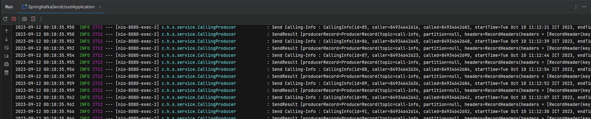

# DEMO SPAM CALL 

------------------------------------------------------------------------------------------------------------------------
## Phần 1: Requirements
### 1. Tổng quan project 
- Phát hiện thuê bao spam theo 2 điều kiện sau:
   + Called có nhãn là spam ussd
   + Hoặc
   + (caller gọi trên 3 cuộc / phút)


### 2. Kiến trúc:
- Module **send-ussd** làm 2 việc sau:
   + Tạo cuộc gọi để làm dữ liệu test, bắn message sang Module Realtime
   + Xử lí response Ussd khảo sát dựa vào các luât ở trên để phát hiện thuê bao spam

- Module **realtime-processing** làm 2 việc sau:
   + Consume thông tin cuộc gọi, Thực hiện gửi Ussd khảo sát tới số called,
   + Giả lập dl phản hồi khảo sát, Rồi bắn lại kết quả khảo sát sang module "send-ussd"

- Mô hình như sau:

------------------------------------------------------------------------------------------------------------------------
## Phần 2 : Implement

### 1. Tạo topic "call-info" (dùng để giả lập bắn 100 cuộc gọi)

```bash
   kafka-topics.sh --bootstrap-server localhost:9092 --topic call-info --create --partitions 3 --replication-factor 1
```

### 2. Giả lập 100 cuộc gọi:
- Run project "spring-kafka-send-ussd"
- Gọi POSTMAN API:
- Kết quả:

### 3. Consume Thông tin 100 cuộc gọi 
- RUn project "realtime-processing-sms"
- Kết quả:
- 
- 
### 4. Tạo topic "ussd-survey" (Dùng để bắn tin khảo sát)
```bash
  kafka-topics.sh --bootstrap-server localhost:9092 --topic ussd-survey --create --partitions 3 --replication-factor 1
```
### 5. Produce message "ussd-survey"
- Code như hình:
- 
- Kết quả: 
- 


### 6. Consume message từ topic "ussd-survey" trong module 'spring-kafka-ussd'
- Code như hình :
- 
- Kết quả: Chắc chắn consume được nhưng lúc viet doc thì lười chạy lại :))


DONE!