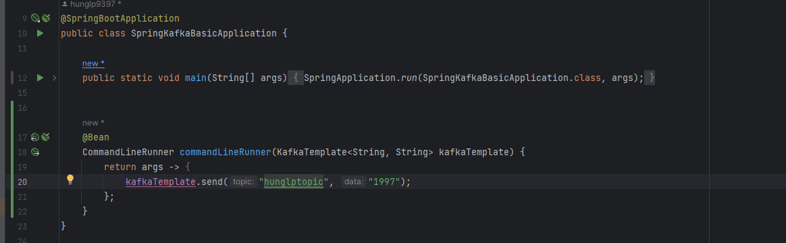
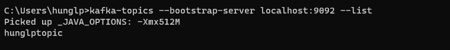
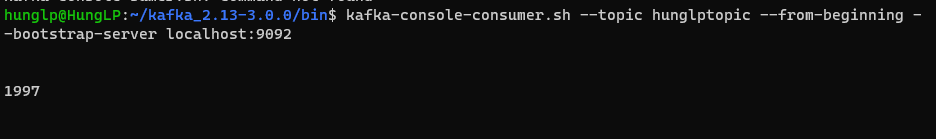
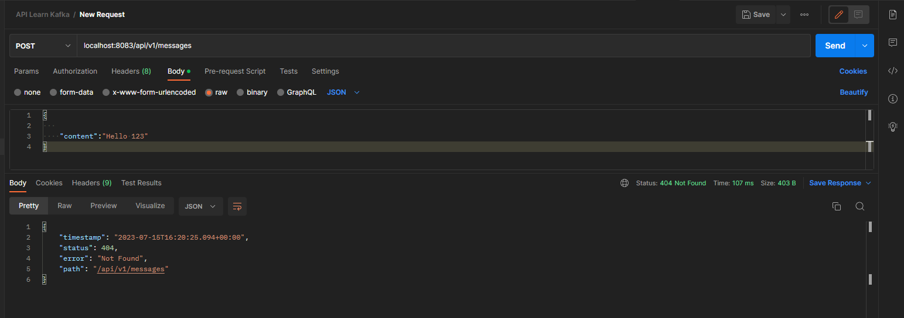
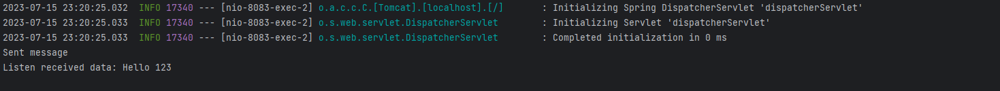

## Các ví dụ Kafka
1Start Kafka như trong mục "install"
2. Cấu hình 1 topic như sau:
    -
3. Ktra topic ở cmd Windows bằng lệnh: `kafka-topics --bootstrap-server localhost:9092 --list`
    - Kết quả
   
4. Kiểm tra nội dung topic ở cmd Ubuntu bằng lệnh : ``kafka-console-consumer.sh --topic hunglptopic --from-beginning --bootstrap-server localhost:9092``
    - Kết quả:
   
5. Event message:
    - 
6. Consume message:
    - 


## Triển khai trên Docker
1. Build file jar
2. Tao docker file:
```dockerfile
FROM openjdk:11
COPY target/spring-kafka-basic-0.0.1-SNAPSHOT.jar /app/spring-kafka-basic-0.0.1-SNAPSHOT.jar
WORKDIR /app
CMD ["java", "-jar", "spring-kafka-basic-0.0.1-SNAPSHOT.jar"]
```
3. Tạo repo tren docker hub, Rồi push images lên docker hub
```shell
docker push 123497/spring-kafka-basic:latest
```

3. Tạo Tạo docker compose
[docker-compose.yml](docker-compose.yml)


4. Dockerize
```shell
   docker compose up -d
```

5. Kết quả:
```shell
D:\Workspace\Learning\kafka_series\My-Source\spring-kafka-basic>docker-compose ps
NAME                IMAGE                    COMMAND                  SERVICE             CREATED              STATUS              PORTS
kafka               wurstmeister/kafka       "start-kafka.sh"         kafka               About a minute ago   Up About a minute   0.0.0.0:9092->9092/tcp
zookeeper           wurstmeister/zookeeper   "/bin/sh -c '/usr/sb…"   zookeeper           About a minute ago   Up About a minute   22/tcp, 2888/tcp, 3888/tcp, 0.0.0.0:2181->2181/tcp
```

6.  Một vài lệnh kafka cơ bản chạy trên docker 
- Tạo topic : `docker-compose exec kafka kafka-topics.sh --create --topic test_topic --partitions 1 --replication-factor 1 --bootstrap-server kafka:9092`
- Publish message : 


