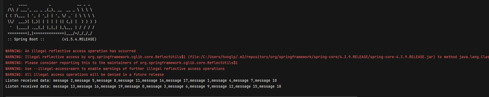

# Kafka batch processing

## Phần 1: Lý thuyết
### 1. Định nghĩa:
- Là cách xử lí dữ liệu lớn trong một khoảng tgian nhất định
- Ví dụ về xử batch : giao dịch thẻ tín dụng, tạo hóa đơn, xử lý đầu vào đầu ra của hệ điều hành


### 2. Use cases:
- Tính toán bảng lương: Tính toán bảng lương cho nhiều nho nhân viên cho các đợt khác nhau trong cùng một lúc
- Thanh toán : Xử lí nhiều giao dịch được ủy quyền cùng một lúc bằng cách ủy quyền mã th tín dụng của KH đến ngân hàng theo một batch
   Sau đó ngân hàng sẽ xử lí một loạt các đơn đặt hàng  -> Giúp loại bỏ nhu cầu xử lí thủ công từng đơn hàng, giúp  tiết kiệm thời gian
### 3. Yêu cầu về phần cứng
- Xử lí batch yêu cầu sử dụng phần lớn tài nguyên để xử lí và lưu trữ

### 4. Performance
- Performance kém, đỗ trễ dao động từ vài phút đến vài giờ
### 5. Tập dữ liệu
- Xử lí batch khi ta biết được kích thước dữ liệu và chỉ xử lí hữu hạn các batch


### 6. Bài toán xử lí:
- Xử lí batch dùng để thực hiện các tính toán và phân tích phức tạp trong 1 khoảng tgian dài


## Phần 2: Thực hành

### 1. Tạo topic
```bash
   kafka-topics.sh --bootstrap-server localhost:9092 --topic simple-batch --create --partitions 3 --replication-factor 1
```
### 2. Chạy file Application
- Ở đây đang setting đọc 10 messsage mõi batch:
```bash 
props.put(ConsumerConfig.MAX_POLL_RECORDS_CONFIG, "10");
```
Kết quả:

