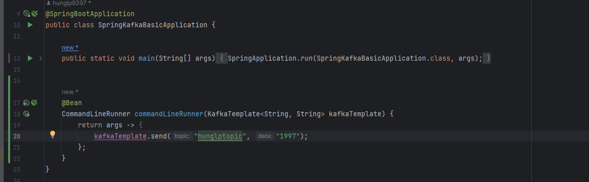
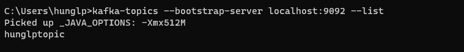
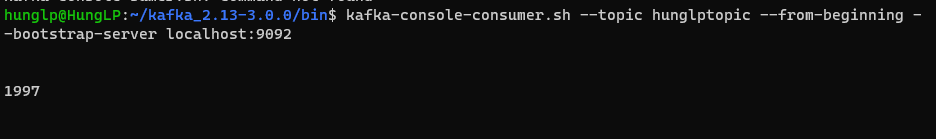

1. Start Kafka như trong mục "cai_dat"
2. Cấu hình 1 topic như sau:
    -
3. Ktra topic ở cmd Windows bằng lệnh: `kafka-topics --bootstrap-server localhost:9092 --list`
    - Kết quả
   
4. Kiểm tra nội dung topic ở cmd Ubuntu bằng lệnh : ``kafka-console-consumer.sh --topic hunglptopic --from-beginning --bootstrap-server localhost:9092``
    - Kết quả:
   