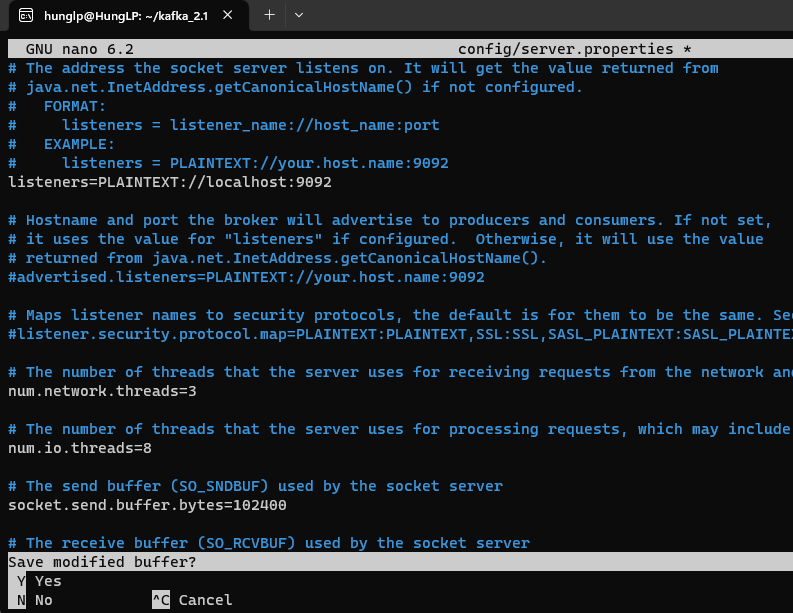
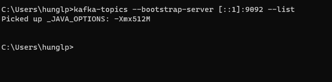

Link : 
https://www.conduktor.io/kafka/how-to-install-apache-kafka-on-windows/

B1. Tải về kafka binary
    Giải nén về (Lưu ý ko được giải nén vào folder ProgramFile hoặc ProgramFile(x86) )
    
 Sau đó add environment với path : _C:\Users\hunglp\kafka_2.13-3.0.0\bin\windows_
    

**B1: Setup network config:**

`sudo sysctl -w net.ipv6.conf.all.disable_ipv6=1
sudo sysctl -w net.ipv6.conf.default.disable_ipv6=1`

**B2 : Start Zookeeper** 

`zookeeper-server-start.sh ~/kafka_2.13-3.0.0/config/zookeeper.properties`

**B3 : Start Kafka** :
`kafka-server-start.sh ~/kafka_2.13-3.0.0/config/server.properties`

FIx Lỗi : 
- Trong Ubuntu APP
    cd tới thư mục kafka, chạy lệnh sau : `nano config/server.properties`
    

- Sửa Listener thành như sau:

- Sau đó vẫn trong thư mục kafka 3.0.0, chạy lệnh : `kafka-server-start.sh config/server.properties`

B4: Trên commandline windows: 
    
    `kafka-topics --bootstrap-server [::1]:9092 --list`
Chạy xong mà k báo lỗi gì là được : 

(Lưu ý ảnh ở bước 4 là đã set listener là [::1] và  
`sudo sysctl -w net.ipv6.conf.all.disable_ipv6=0
sudo sysctl -w net.ipv6.conf.default.disable_ipv6=0`)
