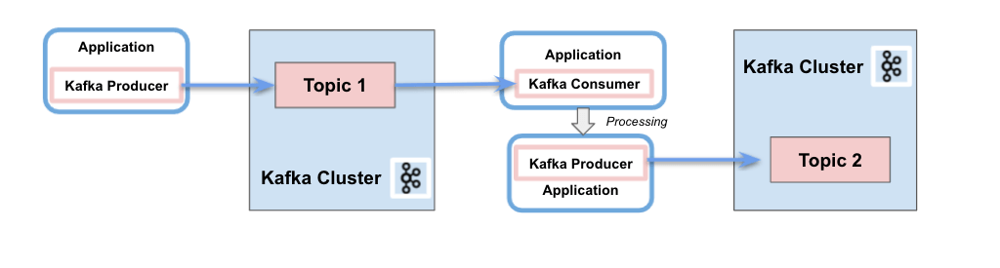
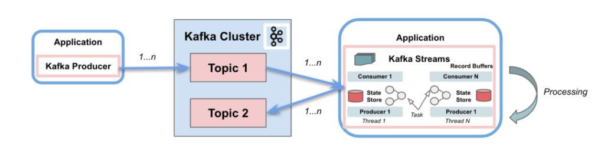
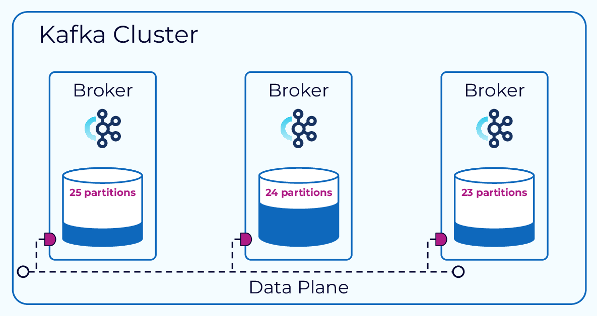
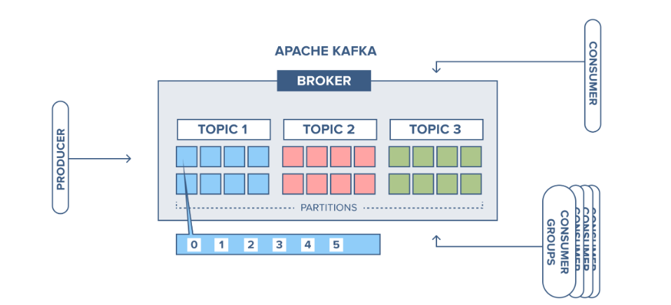
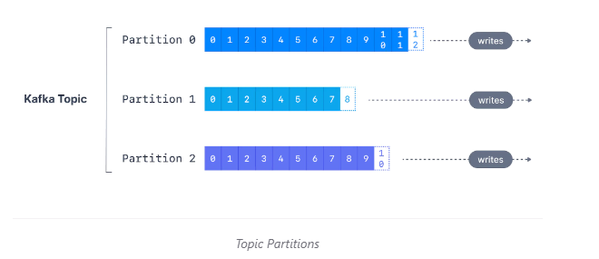
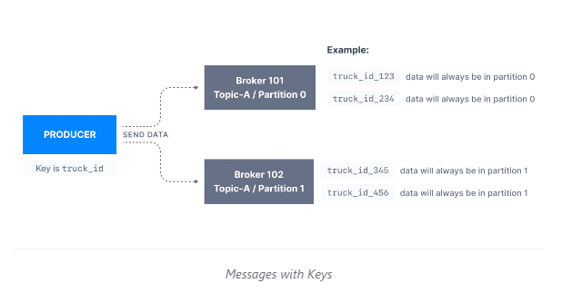
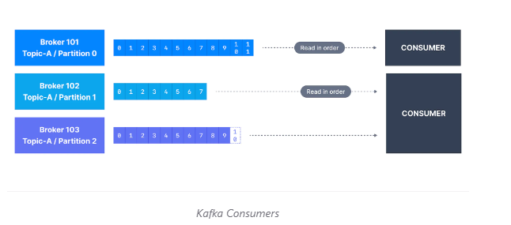
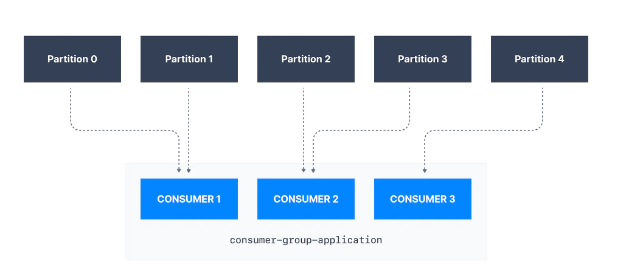
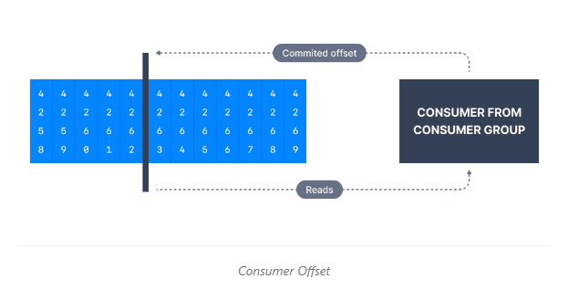

# ----------KAFKA-----------
- Là một hệ thống phân tán, kiến trúc có khả năng phục hồi, chịu lỗi 
- Có thể scale tới 100 broker, hàng nghìn message trên giây
- Hiệu năng cao, thời gian thực
- Kafka đóng vai trò communicate giữa các hệ thống



### 1. Cấu trúc của Apache Kafka:
   - Cấu trúc đơn giản
     + 
   - Cấu trúc chi tiết:
     + 
   
### 2. Kafka Broker Cluster
- 
- Một máy có thể chạy nhiều server kafka
- Mỗi một server đó gọi là broker
- Nếu Tất cả các broker (server kafka) đều trỏ chung tới 1 zookeeper thì được gọi là broker(Clusters)

### 3. Kafka Zookeeper
 - Kiểm soát trạng thái của cluster (brokers, topics, users, …)
   
### 4. Kafka Broker 
- 
- Xử lý tất cả các yêu cầu từ client (produce, consume, metadata) và giữ dữ liệu được sao chép trong cụm. 
- Có thể có một hoặc nhiều broker trong một Cluster (Vừa đề cập ở mục 2).

### 5. Kafka topics
    
- topics là một stream data đặc biệt 
- Tưong tự như table trong 1 datatable, tuy nhiên không thể query topics
- Có thể có nhiều topics nếu muốn, 
- Các topic được xác định bằng tên của topic
- Là một loại của message format
- Thứ tự mesage được gọi là datastream
- Không thể truy vấn topics, Sử dụng Kafka Producer để send data và kafka consumer để đọc data

### 6. Kafka partitions

- 
- Topics được chia thành nhiều partitions
- Trên mỗi dải partitions có nhiều id (gọi là offsets)
=> Một khi data được ghi vào partitions, nó không thể bị thay đổi tức là  Không thể xóa data trong KAFKA

- Ví dụ về Kafka Topíc - Partitions 
    + 1 Cty vận chuyển, có nhiều xe tải tham gia hoạt động vận chuyển
    + Môi 20s các xe tải cần gửi 1 topics là "truck_gps", Topic này bao gồm TruckID và Truck position
    + Topic "truck_gps" có thể được chia thành nhiều partitions, có thể là 10
    + Có thể có nhiều consumers, Giả sử ở đây là 2.
       + Một consumer nhận vị trí của các xe tải và hieern thị lên màn hình
       + Một consumer sẽ nhận thông báo nếu như xe tải gặp phải vấn đề hoặc tai nạn

### 7. Offset

- Trên mỗi dải partitions bao gồm nhiều id ( gọi là offsets)

- Trên cùng một partition, offset được đảm bảo theo thứ tự

- Offset chỉ được keep trong một thời gian nhất định ( Mặc định là 1 tuần)

- Mỗi offset ở mỗi partitions là duy nhất ( Ví dụ offset 3 , partitions 0 sẽ khác data với offset 3, partitions 1)
- Data được lưu với thời gian giới hạn ( mặc định là 2 tuần)
- 
- Offset sẽ k được tái sử dụng mặc dù message trước đó đã bị xóa

### 8. Kafka Producers

-  Producers ghi data vào topics, Nó sẽ tự động  xác định partitions nào sẽ ghi data vào và sẽ tự recover nó
    
-  Producers có thể lựa chọn gửi key cùng với message
         
     + Nếu key = null,
        + Message sẽ ko được Producer chỉ định 
        + Message được chia đều vào các partition trong Topics
        + Và được chia đều theo thuaatj toán round-robin (p0 -> p1 -> p2 -> p0 -> p1 -> p2 -> ....)
     + Nếu  key != null, 
       + Tất cả các message mà có cùng key sẽ được gửi sẽ đến cùng một partitions
       + Do đó có thể dùng để xác định rõ muốn message nào sẽ gửi đến partition nào 
       + 

### 9. Kafka message

- Cấu tạo : 
    + 
    + Key - binary (có thể null)
    + Value - binary ( có thể null)
    + CompressType (none, gzip, snappy, lz4, zstd)
    + Headers(k bắt buộc)
    + Partition + Offset (Combo Partion + Offset + Topic để phân biệt các message với nhau)
    + Timestamp (từ hệ thống hoặc user set giá trị)
        
### 6. Kafka Message Serializer

- Message Serializer là một đối tượng convert data hoặc object sang kiểu byte
- Kafka chỉ cho phép input từ producer là bytes, và output trả về từ consumer là bytes
- Message Serializer thưòng được sử dụng cho value và key của message (mục V)
- Một số Serializer thông dụng:  String, Int, Float, Avro, Protobuf


- VD:
    + Key Object(123)             ------Key Serializer(IntegerSerializer)-----> binary 01110011 
    + Value Object("hello world)  ------Value Serializer (String Serializer) -----> binary 001100100000100001010101001
    
### 7. Kafka Message Key Hashing(Bonus)

- Kafka Partioner là code logic xác định record được đẩy vào partitions nào
- Key hashing là process xác định key sẽ map tới partition nào
- Sử dụng Thuật toán murmur2 :
    targetPartition = Math.abs(Utils.murmur2(keyBytes)) % (numPartitions -1)
    
### 8. Kafka Consumer

- Consumers đọc data từ topic(Nhớ là topic được xác định theo tên)
- Consumers có thể đọc 1 hoặc nhiều partitions tại một thời điểm, Dữ liệu được đọc phải theo thứ tự của mỗi partitions như hình dưới :
   + 
- Consumers sẽ đọc từ offset thấp đến offset cao, và ko thể đọc ngược lại
- Nếu Consumers đọc từ nhiều partitions, Thứ thự tin nhắn sẽ ko được đảm bảo giữa nhiều partions, Tuy nhiên message được đọc vẫn theo thứ tự của từng partition
- Consumers sẽ thực thi bằng cách request message từ Producer -> Do ó consumers có thể kiểm soát được tốc độ của topics mà nó consume đc
- Nhớ rằng Producers gửi message cho Consumers dạng message đã được mã hóa -> Để consumer đọc được thì lại cần giải mã message
- Consumers Deserializer:
   + Deserialzier convert bytes thành objecst/data
   + Thường được dùng cho key và value của message( mục 10)
   + Một số Desserializers thông dụng :  String, Int, Float, Avro, Protobuf
   + Serialization / Deserialization type ko được phép thay đổi trong vòng đời của một topic


### 9. Consumer Group
- 
- Tất cả các consumer trong application mà read data được gọi là Consumer Group
- Mỗi consumer trong Consumer Group có thể đọc nhiều partitions,
- Tuy nhiên các consumer trong consumer group ko thể đọc các partitions của nhau

    
   - ````````
        VD : 
        Consumer 1 -> partition 0
                    -> partition 1
        Consumer 2  -> partition 2 
                    -> partition 3
        Consumer 3  -> partition 4
                    -> partition 5
               
- Nếu Có số lượng Consumer lớn hơn Số lượng Partitions -> Một số consumer sẽ k hoạt động
     ``````
   VD :  
          Consumer 1 -> [Topic A][Partition 0]
          COnsumer 2 -> [Topic A ][Partiion 1]
          Consumer 3 -> [Topic A][Partition 2]
          Consumer 4 (INACTIVE)
         
- Kafka cho phép Consumer( Từ các Consumer Group) read cùng một  topic/partitions 
    
    + GROUP 1 : 
            Consumer 1 -> [Topic A][Partition 0]
            Consumer 2 -> [Topic A][Partition 1]
            Consumer 2 -> [Topic A][Partition 2]
    
    + Group 2 
            Consumer 1 -> [Topic A][Partition 0]
            COnsumer 2 -> [Topic A][Partition 1]
            Consumer 3 -> [Topic A][Partition 2]

### 10. Consumer Offsets
   - 
   -  Kafka lưu vị trí mà consumer group đang đọc
   -  Một offset mà được commited trong Topic được đặt tên là __consumer_ofsets
   - Khi một consumer trong group xử li và đọc data từ Kafka., Nó sẽ được định kì commit offset( Kafka broker sẽ ghi vào __consumer_offset, k phải là consumer group)
   - Nếu một consumer chết, offset có thể back vị trí mà nó vừa rời đi để đến với consumer
   -  Theo mặc định, Java consumer sẽ mặc định commit offset(ít nhât 1 lần)
   - Có 3 tần suất commit offset : 
    + ít nhất 1 lần
    + Đúng 1 lần
    + Nhiều nhất 1 lần

### 11. Kafka Broker 
-   _Hiểu đơn giản là thằng vận chuyển topics/partitions_
-   Một Kafka được cấu tạo bởi nhiều brokers(server)
-   Mỗi brokers được xác định bởi ID (integer)
-   Mỗi broker chứa một số lượng topic, partitions 
-   Sau khi connect tới bất kì brocker nào khác, hệ thống sẽ được kết nối tới toàn bộ cluster
-   Tốt nhất là start với 3 brocker
-  Mỗi kafka broker còn được gọi là bootstrap server, -> nghĩa là chỉ cần connect tới 1 broker là ok

VD : 
    
    Topic A have 3 partitions, 
    Toptic B have 2 partitions
    
    => 
    Brocker 1 : Topic A Partition 0
                Topic B Partitions 1
    
    Brocker 2 : Topic A  Partition 2
                Topic B  Partition 0
    
    Brocker 3 : Topic A, Partition1
    
    
    Node : data được phân bổ, brocker 3 ko thể có bất kỳ Topic B data vì Topic B đã hết partitions
    
    

### 12. Topic Replication factor

- Topic nên có số lần nhân bản > 1 (Thường là 2 hoặc 3)
- Bằng cách này nếu broker bị down, 1 brocker khác có thể phục vụ data
- 


* Leader for a Partition
- Trong một thời điểm chỉ có 1 brocker có thể làm leader cho 1 partition
- Producer chỉ có thể gửi data tới leader partition

### 12. Producer Acknowledgements(ack)

- Producers có thể chọn để nhận acknowledgement của data,
   + acks = 0 -> Producer ko thể đợi ack (data có thể bị mất)
   + acks = 1 -> Producer sẽ đợi ack (Giới hạn data  bị mất)
   + acks = 11 -> Leader + replica ack (data k mất)
       
       
### 13. Topic Durability:
    
- Đối với topic sao chép là 3, topic data chỉ có thể chịu đc 2 brocker mất kết nối
    

### 14. Zookeeper
    
- Zookeeper quản lí brokers
- Zookeeper thực hiện bầu cử leader cho  các partitions
- Zookeeper gửi thông báo cho kafka nếu có bất kì thay đổi nào : new topic, brocker dies, brocker come up, delete topic
- Kafka 2.x ko thể dùng Zoookeeper
- Kafka 3.x có thể làm việc với Zookeeper
- Kafka 4.x ko có Zookeeper

 - Zookeeper được thiết kế hoạt động theo một số lẻ các server : 1,3,5,7
 
 - Lợi ích của Zookeeper:
      + HIển thị khả năng mở rộng của cluster khi có trên 100 000 partitions
    
 - Bằng cách loại bỏ  Zookeeper, Kafka có thể:   
    + Scale tới hàng nghìn partition, dễ dàng cài đặt và maintain
    + Cải thiện tính chắc chắn, Dễ dàng kiểm soát, hỗ trợ và quản trị
    + Là một model bảo mật cho hệ thống
    + Có thể nhanh chóng tắt và phục hồi
    

 


