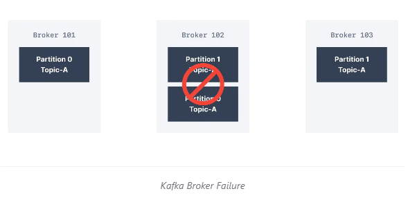

# Tổng quan về message brocker
  ### 1.Định nghĩa
 - Truyền nhận message 
 - Giảm tải cho server bằng cách giảm tải các tương tác trực tiếp
 - Lưu trữ request, trong trường hợp gặp sự cố
 - Phân phối request tới các server trong các bài toán cụ thể
 - Đơn giản hóa quá trình gửi nhận message trong môi trường micro-services
 - 
  ### 2. Các pattern để điều hướng
 - Queue : Thường dùng khi 2 bên nhắn tin với nhau
 - Topic : Dùng khi bắn tin trong group
  ### 3. Phân chia broker theo cách thức hoạt động
 - Message Base
 - Data pipeline
 - Khác nhau :
    + Message base : Lưu trạng thái của consumer để đảm bảo nhận được message 
    + Message bị xóa sau khi consumer consume được message
    + Chỉ nhận được message mới, ko có khả năng lấy lại được các mesage cũ
    + Data pipeline : 
    + Không lưu trạng thái của consumer
    + Có thể cấu hình klaf không xóa message sau khi consumer consume được 
    + Cho phép nconssume được cả message mởi và message cũ
 - 
# ----------KAFKA-----------

## Phần 1 : Những kiến thức cơ bản
- Là một hệ thống phân tán, kiến trúc có khả năng phục hồi, chịu lỗi 
- Có thể scale tới 100 broker, hàng nghìn message trên giây
- Hiệu năng cao, thời gian thực
- Kafka đóng vai trò communicate giữa các hệ thống
- Không mất message nếu config 


### 1. Cấu trúc của Apache Kafka:
   - Cấu trúc đơn giản
     + 
   - Cấu trúc chi tiết:
     + 
   
### 2. Kafka Broker Cluster
- 
- Một máy có thể chạy nhiều server kafka
- Mỗi một server đó gọi là broker
- Nếu Tất cả các broker (server kafka) đều trỏ chung tới 1 zookeeper thì được gọi là Kafka Clusters

### 3. Kafka Zookeeper
 - Kiểm soát trạng thái của cluster (brokers, topics, users, …)
   
### 4. Kafka Broker 
- 
- Xử lý tất cả các yêu cầu từ client (produce, consume, metadata) và giữ dữ liệu được sao chép trong cụm. 
- Có thể có một hoặc nhiều broker trong một Cluster (Vừa đề cập ở mục 2).

### 5. Kafka topics
    
- topics là một stream data đặc biệt 
- Tưong tự như table trong 1 datatable, tuy nhiên không thể query topics
- Có thể có nhiều topics nếu muốn, 
- Các topic được xác định bằng tên của topic
- Là một loại của message format
- Thứ tự mesage được gọi là datastream
- Không thể truy vấn topics, Sử dụng Kafka Producer để send data và kafka consumer để đọc data


### 5.bonus: Kafka segments:
- Kafka broker chia mỗi partition thành nhiều segment
- Mỗi segment được lưu ở một file trong broker
- Mặc định mỗi segment có thể chứa 1GB dât
- Nếu 1 segment nào đó tới giới hạn, nó sẽ đóng file và ghi vào một segment mới
- Chỉ có duy nhất 1 Segment được active tại mộ thời điểm, 
- Segment chỉ có thể bị xóa khi mà nó đã xử lí xong
- Một vài cấu hình:
  + log.segment.bytes: kích thước tối đa (bytes) của một segment
  + log.segment.ms : Thời gian Kafka sẽ chờ trước khi commit segment nếu nó chưa đầy

### 6. Kafka partitions

- 
- Topics được chia thành nhiều partitions
- Trên mỗi dải partitions có nhiều id (gọi là offsets)
=> Một khi data được ghi vào partitions, nó không thể bị thay đổi tức là  Không thể xóa data trong KAFKA

- Ví dụ về Kafka Topics - Partitions 
    + 1 Cty vận chuyển, có nhiều xe tải tham gia hoạt động vận chuyển
    + Môi 20s các xe tải cần gửi 1 topics là "truck_gps", Topic này bao gồm TruckID và Truck position
    + Topic "truck_gps" có thể được chia thành nhiều partitions, có thể là 10
    + Có thể có nhiều consumers, Giả sử ở đây là 2.
       + Một consumer nhận vị trí của các xe tải và hieern thị lên màn hình
       + Một consumer sẽ nhận thông báo nếu như xe tải gặp phải vấn đề hoặc tai nạn

### 7. Offset

- Trên mỗi dải partitions bao gồm nhiều id ( gọi là offsets)

- Trên cùng một partition, offset được đảm bảo theo thứ tự

- Offset chỉ được keep trong một thời gian nhất định ( Mặc định là 1 tuần)

- Mỗi offset ở mỗi partitions là duy nhất ( Ví dụ offset 3 , partitions 0 sẽ khác data với offset 3, partitions 1)
- Data được lưu với thời gian giới hạn ( mặc định là 2 tuần)
- Offset sẽ k được tái sử dụng mặc dù message trước đó đã bị xóa

### 8. Kafka Producers

#### 8.1 Producers ghi data vào topics, Nó sẽ tự động  xác định partitions nào sẽ ghi data vào và sẽ tự recover nó
#### 8.2 Có 3 phương thức để gửi message:**
   - _Fire and forget_ : Gửi message mà không cần quan tâm Consumer có nhận được hay không
  ```bash
    ProducerRecord<String, String> record = new ProducerRecord<>("CustomerCountry", "Precision Products","France");
    try {
      producer.send(record);
    } catch (Exception e) {
      e.printStackTrace();
    }
   ```
  Trong đoạn code trên thì method send() trả về một Future Object cùng với RecordMetadata,

- _Synchronous send_ :
  ```bash
     RecordMetadata metadata;
        for (int i = 1; i <= numEvents; i++) {
            metadata = producer.send(new ProducerRecord<>(topicName, i, "Simple Message-" + i)).get();
             logger.info("Message " + i + " persisted with offset " + metadata.offset()
              + " and timestamp on " + new Timestamp(metadata.timestamp()));
     }
  ```
  Với việc gửi đồng bộ, thì thread sẽ mất thời gian chờ đợi tin đuược gửi xong mà ko làm gì -> Điều này làm ảnh hưởng đến hiệu suất của chương trình

  Trong đoạn code trên thì nếu send() mà ko lỗi thì sẽ trả về RecordMetaData để có thể biết được offset nào đã được message ghi vào 
  - _Asynchronous send__: Cách này được sử dụng nhiều nhất,Gọi hàm send() cùng với callback() function,Hàm callback sẽ được trigger khi nhận phản hồi từ Kafka broker
  ```bash
    private class DemoProducerCallback implements Callback {
        @Override
        public void onCompletion(RecordMetadata recordMetadata, Exception e) {
         if (e != null) {
           e.printStackTrace();
         }
       }
     }
  
  ProducerRecord<String, String> record =  new ProducerRecord<>("CustomerCountry", "Biomedical Materials", "USA");
  producer.send(record, new DemoProducerCallback());
  ```
  Lợi ích thực tế của việc gửi bất đồng bộ này là: Cùng với callBack, Ta có thể xử lí trờng hợp gửi message thất bại như là throw exception, log exception, hoặc ghi log lỗi vào file

-
#### 8.3 Producer biết được message được ghi vào thành công partition nào  bằng cơ chế ack
  + _acks=0:_ giống fire-and-forget, gửi message mà không chờ phản hồi. Do vậy có thể dẫn đến tình huống mất message.
  +  _acks=1:_ default setting. Lần này chắc chắn hơn, producer chờ cho tới khi nhận được phản hồi từ replication leader. Tuy nhiên chưa ngăn chặn hoàn toàn việc mất message. Replication leader write message thành công, báo lại cho producer, tuy nhiên broker có thể gặp sự cố với disk, không thể khôi phục data.
  +  _acks=all:_ lần này thì quá chắc chắn, đảm bảo không mất message. Producer sẽ nhận được phản hồi khi tất cả replication leader và IRS write data thành công.
-  Producers có thể lựa chọn gửi key cùng với message
         
     + Nếu key = null,
        + Message sẽ ko được Producer chỉ định 
        + Message được chia đều vào các partition trong Topics
        + Và được chia đều theo thuật toán round-robin (p0 -> p1 -> p2 -> p0 -> p1 -> p2 -> ....)
     + Nếu  key != null, 
       + Tất cả các message mà có cùng key sẽ được gửi sẽ đến cùng một partitions
       + Do đó có thể dùng để xác định rõ muốn message nào sẽ gửi đến partition nào 
       + 

### 9. Kafka message

- Cấu tạo : 
    + 
    + Key - binary (có thể null)
    + Value - binary ( có thể null)
    + CompressType (none, gzip, snappy, lz4, zstd)
    + Headers(k bắt buộc)
    + Partition + Offset (Combo Partion + Offset + Topic để phân biệt các message với nhau)
    + Timestamp (từ hệ thống hoặc user set giá trị)
        
### 6. Kafka Message Serializer

- Message Serializer là một đối tượng convert data hoặc object sang kiểu byte
- Kafka chỉ cho phép input từ producer là bytes, và output trả về từ consumer là bytes
- Message Serializer thưòng được sử dụng cho value và key của message (mục V)
- Một số Serializer thông dụng:  String, Int, Float, Avro, Protobuf


- VD:
    + Key Object(123)             ------Key Serializer(IntegerSerializer)-----> binary 01110011 
    + Value Object("hello world)  ------Value Serializer (String Serializer) -----> binary 001100100000100001010101001
    
### 7. Kafka Message Key Hashing(Bonus)

- Kafka Partioner là code logic xác định record được đẩy vào partitions nào
- Key hashing là process xác định key sẽ map tới partition nào
- Sử dụng Thuật toán murmur2 :
    targetPartition = Math.abs(Utils.murmur2(keyBytes)) % (numPartitions -1)
    
### 8. Kafka Consumer

- Consumers đọc data từ topic
- Consumers có thể đọc 1 hoặc nhiều partitions tại một thời điểm, Dữ liệu được đọc phải theo thứ tự của mỗi partitions như hình dưới :
   + 
- Consumers sẽ đọc từ offset thấp đến offset cao, và ko thể đọc ngược lại
- Nếu Consumers đọc từ nhiều partitions, Thứ thự tin nhắn sẽ ko được đảm bảo giữa nhiều partions, Tuy nhiên message được đọc vẫn theo thứ tự của từng partition
- Consumers sẽ thực thi bằng cách request message từ Producer -> Do đó consumers có thể kiểm soát được tốc độ của topics mà nó consume đc
- Một consumer cũng có thể đọc message từ một hoặc nhiều hoặc tất cả partition trong một topic.
- Nhớ rằng Producers gửi message cho Consumers dạng message đã được mã hóa -> Để consumer đọc được thì lại cần giải mã message
- Consumers Deserializer:
   + Deserialzier convert bytes thành objecst/data
   + Thường được dùng cho key và value của message( mục 10)
   + Một số Desserializers thông dụng :  String, Int, Float, Avro, Protobuf
   + Serialization / Deserialization type ko được phép thay đổi trong vòng đời của một topic


### 9. Consumer Group
- 
- Tất cả các consumer trong application mà read data được gọi là Consumer Group
- Một consumer có thể nhận message từ nhiều partition. Nhưng một partition không thể gửi message cho nhiều consumer trong cùng consumer group.
  + 
               
- Nếu Có số lượng Consumer lớn hơn Số lượng Partitions -> Một số consumer sẽ k hoạt động
    + 
         
- Kafka cho phép Consumer( Trong cùng một  Consumer Group) consume  cùng một topic/partitions 
    ````
    + GROUP 1 : 
            Consumer 1 -> [Topic A][Partition 0]
            Consumer 2 -> [Topic A][Partition 1]
            Consumer 2 -> [Topic A][Partition 2]
    
    + Group 2 
            Consumer 1 -> [Topic A][Partition 0]
            COnsumer 2 -> [Topic A][Partition 1]
            Consumer 3 -> [Topic A][Partition 2]

### 10. Consumer Offsets
   - 
   -  Khi consumer xử lý xong message, chúng ta nên commit giá trị offset, các giá trị này sẽ lưu tại Kafka topic có tên là __consumer_offsets
   - Khi một consumer trong group xử li và đọc data từ Kafka., Nó sẽ được định kì commit offset( Kafka broker sẽ ghi vào __consumer_offset, k phải là consumer group)
   - Nếu một consumer chết, offset có thể back vị trí mà nó vừa rời đi để đến với consumer
   -  Theo mặc định, Java consumer sẽ mặc định commit offset(ít nhât 1 lần)
   - Có 3 tần suất commit offset : 
    + ít nhất 1 lần
    + Đúng 1 lần
    + Nhiều nhất 1 lần

### 11. Kafka Broker 
-   _Hiểu đơn giản là thằng vận chuyển topics/partitions_
-   Một Kafka được cấu tạo bởi nhiều brokers(server)
-   Mỗi brokers được xác định bởi ID (integer)
-   Mỗi broker chứa một số lượng topic, partitions 
- Thông thường là start với 3 broker
-  Mỗi kafka broker còn được gọi là bootstrap server, -> nghĩa là chỉ cần connect tới 1 broker là ok

- Ví dụ trong trường hợp sau có 3 broker, Topic A có 3 partition, Để đảm bảo high reliable, Kafka tự động phân tán các partition trên tất cả broker đang có. Mỗi partition nằm trên một broker

- Giả sử có thêm một Topic B có 2 partitions, Khi đó sẽ được phân bổ như sau:
   
- Tiếp tục có thêm một topic với số lượng partition lớn hơn số lượng broker:
  

### 12. Topic Replication factor
- Đánh giá: Cách tổ chức broker và partition như trên vẫn chưa giải quyết được triệt để,
- Do đó cần làm như sau: Tạo ra nhiều bản sao cho partition và lưu trên broker khác thông qua replication factor
- Như hình sau: Nếu broker 102 gặp sự cố thì đã có backup từ Broker 101 và 103:

   + 
   + 

- Leader for a Partition
  + Trong một thời điểm chỉ có 1 broker có thể làm leader cho 1 partition
  + Mỗi một partition sẽ có 1 leader và nhiều replica
  + Các replication còn lại được gọi là ISR, đồng bộ message từ replication leader.
  + Do vậy, mỗi partition có duy nhất một replication leader và một hoặc nhiều ISR - in-sync replica.
  + Producer chỉ có thể gửi data tới leader partition
  + 
    + Ở hình trên thì:
    + Broker 101 là Leader của partition 0
    + Brokder 102 là Leader của partition 1
    + Broker 101 là replica cho Broker 0
    + Broker 103 là replica cho broker 1
    + Khi một leader bị down => Leader fail sẽ đươ thế chỗ
      . In-Sync Replicas (ISR).
### 13.In-Sync Replicas (ISR).
- Nó để ám chỉ rằng những Replica sẵn sàng được lên làm Leader Broker cho 1 partition. 
- Bất kỳ những replica khác không sẵn sàng lên làm Leader thì gọi là out of sync.
- Hình ảnh mô tả cho nó sẽ như sau:
- 
### 14. Producer Acknowledgements(ack)

- Producers có thể chọn để nhận acknowledgement của data,
   + acks = 0 -> Producer ko thể đợi ack (data có thể bị mất)
   + acks = 1 -> Producer sẽ đợi ack (Giới hạn data  bị mất)
   + acks = 11 -> Leader + replica ack (data k mất)
       
       
### 15. Topic Durability:
    
- Đối với topic sao chép là 3, topic data chỉ có thể chịu đc 2 brocker mất kết nối
    

### 16. Zookeeper
    
- Zookeeper quản lí brokers
- Zookeeper thực hiện bầu cử leader cho  các partitions
- Zookeeper gửi thông báo cho kafka nếu có bất kì thay đổi nào : new topic, brocker dies, brocker come up, delete topic
- Kafka 2.x ko thể dùng Zoookeeper
- Kafka 3.x có thể làm việc với Zookeeper
- Kafka 4.x ko có Zookeeper

 - Zookeeper được thiết kế hoạt động theo một số lẻ các server : 1,3,5,7
 
 - Lợi ích của Zookeeper:
      + HIển thị khả năng mở rộng của cluster khi có trên 100 000 partitions
    
 - Bằng cách loại bỏ  Zookeeper, Kafka có thể:   
    + Scale tới hàng nghìn partition, dễ dàng cài đặt và maintain
    + Cải thiện tính chắc chắn, Dễ dàng kiểm soát, hỗ trợ và quản trị
    + Là một model bảo mật cho hệ thống
    + Có thể nhanh chóng tắt và phục hồi
    

## Phần 2: Advanced
### 2.1 Topic Advanced

### 2.1.1: Cách để gửi một message có size lớn trong Kafka?
- Kích thước tối đa của tin nhắn là 1MB

### 
 


### Phần 3 : Kafka Stream:
### 1. Khác nhau giữa consumer API và StreamData

- Consumer API:
   


- Kafka Stream API:
  