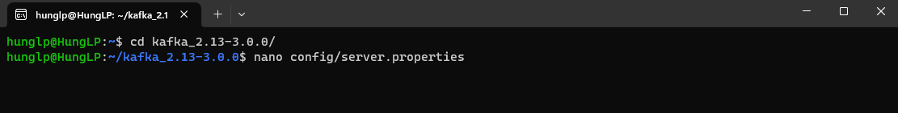
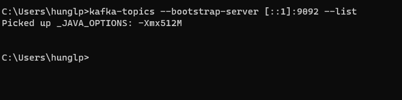
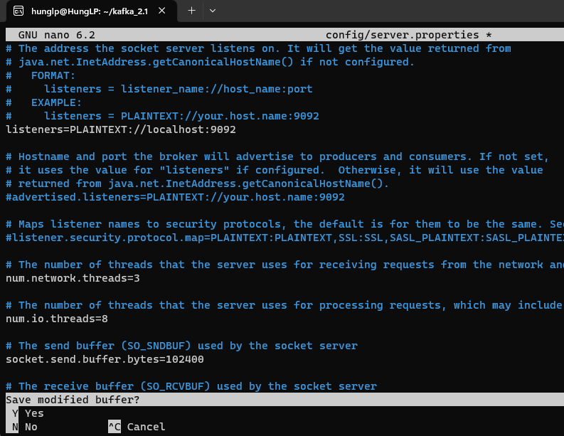

#  Cài đặt và khởi động Kafka
Link :
https://www.conduktor.io/kafka/how-to-install-apache-kafka-on-windows/

## CÁCH 1: Start KAFKA bằng ZOOKEEPER

### B0. Tải về kafka binary

- Giải nén về (Lưu ý ko được giải nén vào folder ProgramFile hoặc ProgramFile(x86) )
- Sau đó add environment với path : _C:\Users\hunglp\kafka_2.13-3.0.0\bin\windows_

### B1: Tải app Ubuntu, mk là : hunglp

### B2: Setup network config:
`sudo sysctl -w net.ipv6.conf.all.disable_ipv6=1
sudo sysctl -w net.ipv6.conf.default.disable_ipv6=1`

### B3 : Start Zookeeper
- Mở app Ubuntu trên windows
- Chạy lệnh sau:
`zookeeper-server-start.sh ~/kafka_2.13-3.0.0/config/zookeeper.properties`

### B4 : Start Kafka:
- Mở app Ubuntu trên windows
- Chạy lệnh sau:
`kafka-server-start.sh ~/kafka_2.13-3.0.0/config/server.properties`

### FIx Lỗi : 
- Trong Ubuntu APP  cd tới thư mục kafka:  `cd kafka_2.13-3.0.0/`
- chạy lệnh sau : `nano config/server.properties`
    
- Sửa Listener thành như sau:

- Sau đó vẫn trong thư mục kafka 3.0.0, chạy lệnh : `kafka-server-start.sh config/server.properties`

### B5: Trên commandline windows:

- Chạy lệnh:
    `kafka-topics --bootstrap-server localhost:9092 --list`
- Chạy xong mà k báo lỗi gì là được : 
  + 

- Lưu ý : nếu mà ko phải chạy ở localhost thì sửa listener là [::1] và set:
`sudo sysctl -w net.ipv6.conf.all.disable_ipv6=0
sudo sysctl -w net.ipv6.conf.default.disable_ipv6=0`)

## CÁCH 2: Start Kafka in KRaft mode

### B1:

- Trên Ubuntu App chạy lệnh : `kafka-storage.sh random-uuid`
- Kết quả:
  + 

### B2: Dùng mã vừa gen ra ở trên thay thế vào <uuid> bằng lệnh:

`kafka-storage.sh format -t <uuid> -c ~/kafka_2.13-3.0.0/config/kraft/server.properties`

 - Ví dụ:
  + 

### B3:

- Chạy lệnh : `kafka-server-start.sh ~/kafka_2.13-3.0.0/config/kraft/server.properties`

 - Kết quả :
 + 
