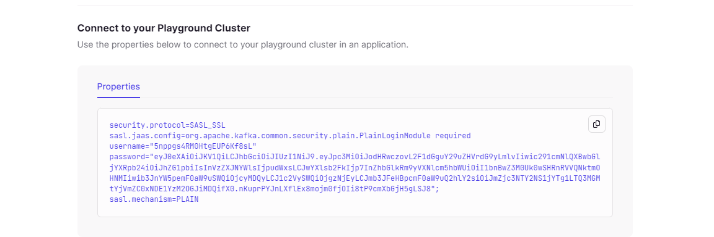
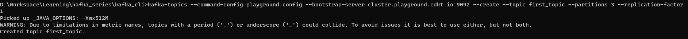
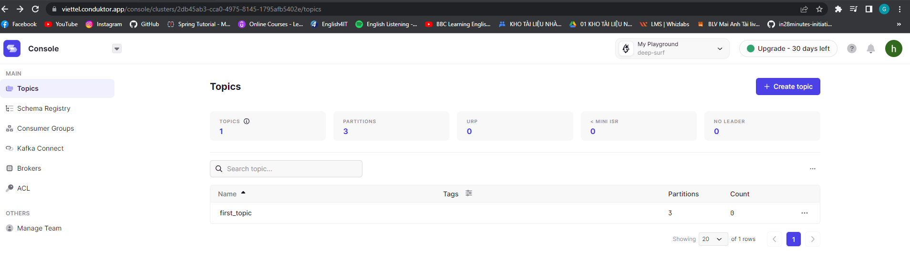
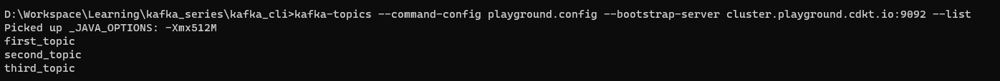
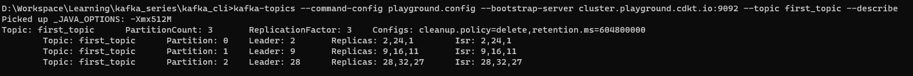
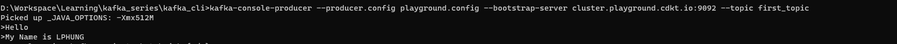
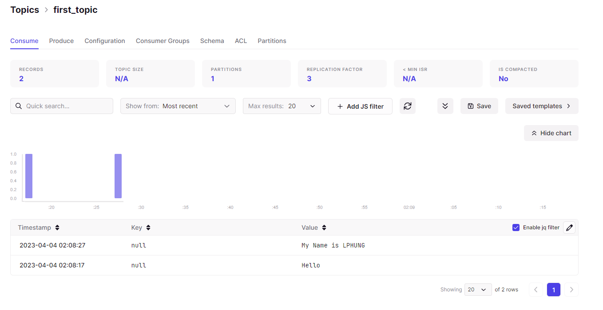

**KAFKA CLI**

[Source : ](../../reference-source-conducktor/code/1-kafka-cli)

**Folder thực hành project** :  _/kafka_series/kafka_cli_

- B1: Vô trang conduktor.io tạo tài khoản

    Sau đó bấm vô Playground
    
    Thu được kết quả như hình : 
    

- B2: Cd tới thư mục kafka_cli
    
    Tạo file playground.config với content là cái vừa tạo ở B1
    

- B3: Vẫn trong thư mục kafka_cli, tạo topics bằng lệnh :

`kafka-topics --command-config playground.config --bootstrap-server cluster.playground.cdkt.io:9092 --create --topic first_topic --partitions 3 --replication-factor 1`

=> 
Kết quả : 

**Tạo topics có 5 partitions bằng lệnh :**

`kafka-topics --command-config playground.config --bootstrap-server cluster.playground.cdkt.io:9092 --create --topic second_topic --partitions 5 --replication-factor 2
`

#list topics

`kafka-topics --command-config playground.config --bootstrap-server cluster.playground.cdkt.io:9092 --list`

#describe topics

`kafka-topics --command-config playground.config --bootstrap-server cluster.playground.cdkt.io:9092 --topic first_topic --describe
`

#producing

(Gõ Ctrl + C để dừng produce)

Kết quả:

# producing with properties acks all

kafka-console-producer --producer.config playground.config --bootstrap-server cluster.playground.cdkt.io:9092 --topic first_topic --producer-property acks=all

