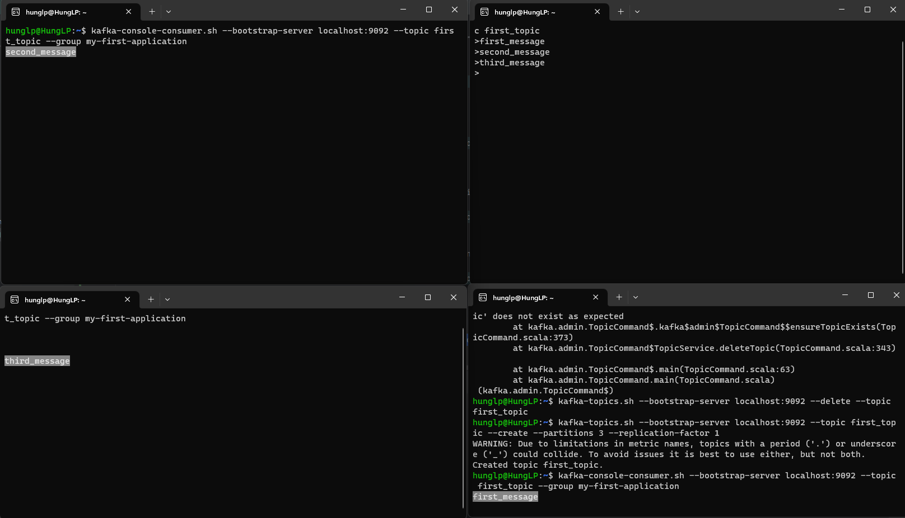
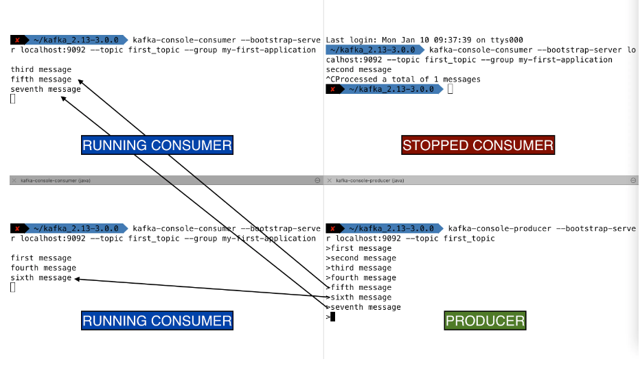
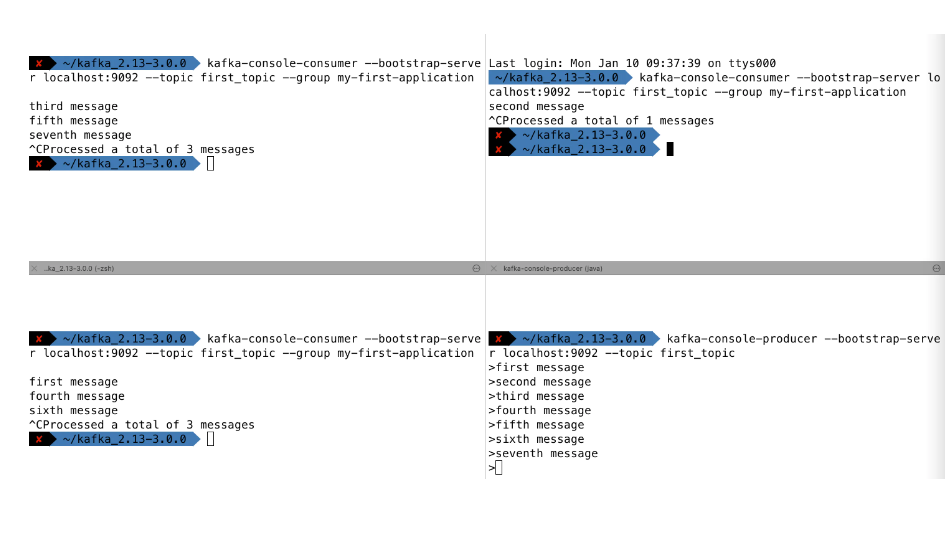

# Kafka Consumers in Group CLI 


### 1. Tạo consumer trong Consumer Groups
#### B1 : Tạo topic với ít nhất  2 partitions và send data vào topic đó
```bash
kafka-topics.sh --bootstrap-server localhost:9092 --topic first_topic --create --partitions 3 --replication-factor 1
```

#### B2 : Chạy 1 consumer trên consumer_group tên là : _my-first-application_
```bash
kafka-console-consumer.sh --bootstrap-server localhost:9092 --topic first_topic --group my-first-application 

``` 

#### B3 : Mở một terminal khác và chạy 1 consumer nữa trên consumer_group : _my-first-application_
```bash
kafka-console-consumer.sh --bootstrap-server localhost:9092 --topic first_topic --group my-first-application 
```

#### B4 : Mở một terminal khác và chạy 1 consumer nữa trên : _my-first-application_
```bash
kafka-console-consumer.sh --bootstrap-server localhost:9092 --topic first_topic --group my-first-application 
```

#### B5 : Produce message trên topic : first_topic:
```bash
kafka-console-producer.sh --bootstrap-server localhost:9092 --topic first_topic
```

#### Kết quả: Mỗi consumer trong consumer_group đều consume được data
  + 

#### B6: Nếu dừng 1 consumer nào đó trong consumer group -> Các consumer còn lại sẽ nhận message
  + 

### Optional: Nếu dừng tất cả các consumer trong ConsumerGroup, mà Producer vẫn tiếp tục produce message -> Thì khi đó khi start một consumer, thì sẽ chỉ consume được mesage mới nhất


```bash
>eigth message
>ninth message
>tenth message
 ```


-----
```bash
$ kafka-console-consumer.sh --bootstrap-server localhost:9092 --topic first_topic --group my-first-application

eigth message
ninth message
tenth message
```