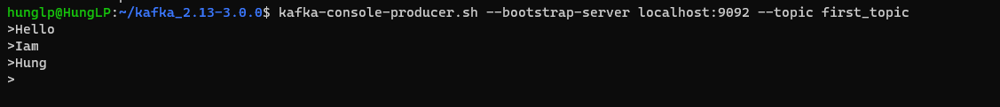
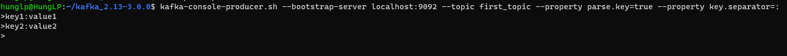

# CÁC LỆNH KAFKA PRODUCERS CƠ BẢN

### 1. Điều kiện tiên quyết: Tạo topic
```bash
kafka-topics.sh --bootstrap-server localhost:9092 --topic first_topic --create --partitions 3 --replication-factor 1

```

### 2. Produce message:

```bash
kafka-console-producer.sh --bootstrap-server localhost:9092 --topic first_topic
```
- Kết quả:
  + 


### 3. Produce message từ file

- Tạo file topic-input.txt
- Chạy lệnh:
```bash
kafka-console-producer.sh --bootstrap-server localhost:9092 --topic first_topic < topic-input.txt
```


### 4. Produce message với key 
- Note : Vì mặc định message là null keys

```bash
kafka-console-producer.sh --bootstrap-server localhost:9092 --topic first_topic --property parse.key=true --property key.separator=:
````

- Kết quả:
- 