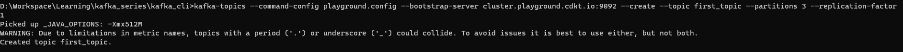

**KAFKA CLI**

[Source : ](../Source/code/1-kafka-cli)

**Folder thực hành project** :  _/kafka_series/kafka_cli_

**B1:** Vô trang conduktor.io tạo tài khoản

Sau đó bấm vô Playground

Thu được kết quả như hình : 

**B2:** Cd tới thư mục kafka_cli

 Tạo file playground.config với content là cái vừa tạo ở B1

B3: Vẫn trong thư mục kafka_cli, tạo topics bằng lệnh : `kafka-topics --command-config playground.config --bootstrap-server cluster.playground.cdkt.io:9092 --create --topic first_topic --partitions 3 --replication-factor 1`

=> 
Kết quả : 

